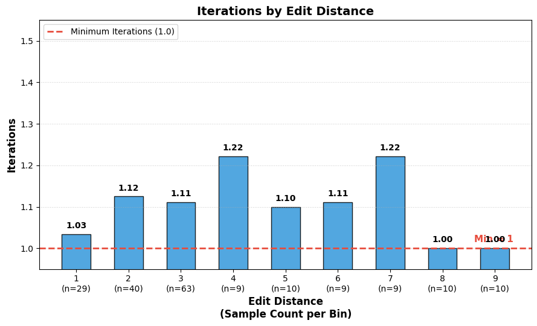

## Solver agent evaluation result

### Single mutation per step

- Total Average Iterations:1.06
- Total Cost: $7.5615
- Total failed: 7/120
- Corrected total failed(in 3iter): 1/120

- Average Iterations by Mutation Score:

  | mutation_score | avg_iterations |
  | :------------: | :------------: |
  |      1.00      |      1.00      |
  |      2.00      |      1.10      |
  |      3.00      |      1.06      |
  |      4.00      |      1.11      |
  |      5.00      |      1.00      |
  |      6.00      |      1.11      |

- **Failed cases**
  - checker making error for
    - holt_s6-2_theorem6-2-1_p1_c1.txt (2) -> fixed checker
    - holt_s6-2_theorem6-2-1_p2_c1.txt (2) -> fixed checker
  - parsing failed --> will be fixed if step numbers are reordered in wrong
    proof generation step
    - holt_s4-4_ex4_2corrs_inc4 (also the generated altint doesn't have all
      param and angles are noted as EGF instead of a_EGF) -> fixed prompt

    - holt_s4-5_ex3_2corrs_inc10 -> fixed prompt

  - holt_s4-6_exer11_3corrs_inc1
    - missing step 3
    - but the corrections are correct for all 3 mutated steps
    - --> solved in 1 trial when ran again.

### Multimutation per step

- Total Average Iterations:1.1
- Total Cost: $2.319
- Total failed: 3/80
- Corrected total failed(in 3iter): ?/80
- Average iterations per edit distance
- edit_distance avg_iterations

  | edit_distance | avg_iterations |
  | :-----------: | :------------: |
  |     2.00      |      1.44      |
  |     3.00      |      1.20      |
  |     4.00      |      1.22      |
  |     5.00      |      1.00      |
  |     6.00      |      1.11      |
  |     7.00      |      1.22      |
  |     8.00      |      1.00      |
  |     9.00      |      1.00      |

**Failed cases**

- holt_s11-6_cio6_2corrs_inc1 --> object undefined
- holt_s6-4_cio4_4corrs_inc1 --> 4 corruptions in step 6 llm made no changes and
  looped
- holt_s3-3_exer38_6corrs_inc1 --> llm AuthenticationError
