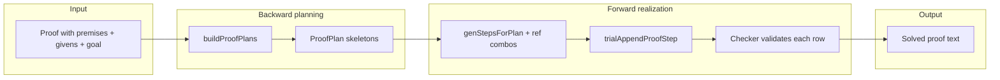

# Geometry proof solver

The solver attempts to complete a partially specified proof: given premises, givens, and a goal, it searches for additional proof rows that the checker accepts and that establish the goal. It does **not** invent new geometry; every candidate step is validated by the same proof checker used for human-written proofs.

## Architecture: plan then realize

The solver uses two phases:

### 1. Backward planning (`proofPlan.ts`)

Starting from the **goal statement function** (e.g. `con_seg`, `para`, `con_tri`), the planner works backward:

1. Find reason definitions whose conclusion matches the subgoal (including **statement groups** such as `congruent_angs` → `con_ang`).
2. For each reason, recursively plan subgoals for each proof dependency slot, left to right.
3. Merge child plans (Cartesian product, capped by `maxChildPlans`).
4. Append the parent reason as one planned row.

A **proof plan** is only a skeleton: reason names, conclusion types, and dependency slot types—not specific segment/angle labels or step numbers.

**Already-satisfied subgoals** contribute zero rows: givens, existing proof rows, or (when registered) rows that satisfy a **parent dependency slot** check (see below).

Plans are ranked by `planQuality` (shorter chains preferred; bonus for `reflex_a → asa → cpctc` on overlap-style problems). Enumeration stops at `maxPlans`, `maxDepth` (max planned rows), or when `onNewCompleteRootPlan` aborts backward search after an early forward success.

### 2. Forward realization (`solver.ts`)

For each plan, the solver walks planned rows in order:

1. **Dependency references** — `refCombinations` picks distinct numeric step refs per slot from existing proof rows matching required statement types (diagram deps must exist in premises when the reason requires them).
2. **Conclusion statements** — `genStepsForPlan` builds candidate `Stmt` values:
   - **Scoped object pool** from dependency rows + matching diagram premises (falls back to full premise context).
   - **Combinatorial enumeration** of geometry labels in the pool (`argCombinations`), with symmetric deduplication for binary relations.
   - **Goal-directed shortcuts** when the last plan step must match the proof goal (exact goal stmt, premise triangle pair, reflex rows, CPCTC corresponding parts, `midpt` from `on_line` diagram rows).
3. **Checker trial** — each candidate is appended via `trialAppendProofStep` (incremental graph update). The first candidate that passes checker validation advances; failed candidates are recorded in `SolverAttempt` stats.
4. **Depth-first backtracking** across candidates at each plan step.

If no plan succeeds, `solve` may **retry** with `allowCpctcForCongruentParts` enabled so backward planning may use `cpctc` to fill `con_seg` / `con_ang` dependency slots (not only as a final goal step).

## Entry point: `solve(proof, opts)`

| Option | Default | Role |
|--------|---------|------|
| `maxDepth` | 4 | Max proof rows in a plan |
| `maxPlans` | 500 (1 if `stopAfterFirstPlan`) | Cap complete plans collected |
| `maxCandidatesPerStep` | 1000 | Cap forward candidates per planned row |
| `maxChildPlans` | 16 (1 if stopping early) | Cap child plans per dependency slot in backward merge |
| `stopAfterFirstPlan` | false | Stop after first complete plan / first forward solve |
| `allowCpctcForCongruentParts` | false | First pass; auto-retry with `true` on failure |
| `logBackwardChains` | 0 | Record backward chains for stats logs |

**Startup**

- Clones the proof and runs `seedGivenSteps` so numbered `given(...)` rows become proof rows (if the file had no proof rows yet).
- Validates premises + givens via `runProofChecker`; returns `invalid-start` on geometry/graph errors.
- Builds `ProofContent` from premises and runs `checkAngleOverlaps()` so angle alias names match the checker.

**Results:** `solved` | `invalid-start` | `not-found` | `capped` (see `types.ts`).

## Special cases and heuristics

### Shallow reflex plans rejected

A one-step plan consisting only of `reflex_s` or `reflex_a` whose conclusion **type** equals the goal type is discarded. Reflexive rows prove “some segment/angle is congruent to itself,” not a specific goal instance (e.g. `con_seg(FG, HG)`).

### Geometry budget (`geometryBudget`)

Backward search tracks how many conclusions of each kind may appear, based on named objects in premises (and triangles implied by the premise context). Examples:

- At most **n choose 2** distinct `con_tri` rows for *n* named triangles.
- At most one `cpctc` per established `con_tri`.
- Caps on `con_seg`, `con_ang`, etc., tied to premise counts.

This prunes impossible plans (e.g. duplicate triangle congruence goals).

### Backward rule filtering (`backwardRuleAllowed`)

- **`cpctc` for `con_seg` subgoals** — off unless `allowCpctcForCongruentParts` (avoids proving a segment goal via CPCTC before any `con_tri` exists).
- **`altint` vs `altint_conv`** — for a `para` goal, only `altint_conv` is used backward (converse direction).
- **Statement-group slots** (e.g. `congruent_angs` under SAS) — no multi-step rules with proof dependencies; need a direct `con_ang` row.
- **`rectangle`** — not used backward to derive `con_seg` / `con_ang`.
- **`*_conv` on definitions** — blocked unless the definition statement is the root goal.
- **`midpt_conv` / `def_midpt`** — at most one of each in a chain.
- **Duplicate `reflex_s`** — discouraged in one plan.

### ASA + single premise angle

When planning under `asa` for a `congruent_angs` slot and premises declare exactly one `ang:`, backward search **drops `reflex_s`** so the middle angle slot is filled by `reflex_a` (overlap proofs).

### Parent dependency slots (`parentDepSlot.ts`)

When a subgoal fills a slot for a parent rule (e.g. `altint_conv` needs a `con_ang` that is alternate interior with respect to the goal `para`), type-matching rows are insufficient. Registered checks (e.g. `altint(row, transversal, goal)`) decide whether an existing proof row already satisfies the slot. Under a registered parent, backward search may **skip** shallow `vert_ang` / `reflex_a` in favor of `cpctc`.

### Forward candidate ranking

- **`vert_ang`** — prefers `con_ang` pairs that share a vertex but no common side (vertical angle pair).
- **`asa`** — slight preference for dependency order `2, 1, 3` (matches common givens ordering in fixtures).

### Statement / reference matching

- **Angles** — compared by vertex + unordered endpoints (`angleKey`), so `GEH` and `EGH` match when appropriate.
- **Segments / triangles** — compared by sorted point labels.
- **Binary symmetric statements** — `con_seg(AB, CD)` equivalent to `con_seg(CD, AB)` for duplicate detection.

### Premise-driven statement seeds (forward)

| Reason | Seed when goal/premises fit |
|--------|-----------------------------|
| `reflex_s` | Shared side of the two premise triangles, or shared side of a `con_tri` goal |
| `reflex_a` | Sole `ang:` in premises (e.g. `a_EGD`) |
| `con_tri` (last step) | Exactly two `tri:` in premises |
| `cpctc` | `cpctcCorrespondingConclusions` from the referenced `con_tri` |
| `midpt` | `on_line` diagram rows converted to `midpt` candidates |

### Interleaved forward on complete plans

While backward search runs, each **new complete root plan** can trigger `realizePlan` immediately (`onNewCompleteRootPlan`). Pending plans are flushed sorted by `planQuality` so a good overlap chain can solve before enumerating thousands of SAS variants.

### Unsafe / undefined reasons

`given`, `paralellogram1/2`, `equilateral`, `aaa` are excluded from planning (`UNSAFE_REASONS`).

## Design considerations

1. **Checker as oracle** — The solver never weakens rules; search only composes checker-valid steps. This keeps UI, CLI, and auto-proof behavior aligned.
2. **Plans vs. labels** — Backward search reasons about **statement types**; label assignment is deferred to forward enumeration, keeping branching smaller until geometry is fixed.
3. **Incremental checking** — `trialAppendProofStep` reuses the proof graph and reason applicability index so each trial is cheaper than a full re-check.
4. **Memoization** — `plansForSubgoal` memoizes on subgoal, depth, occurrence, parent context, and conclusion quotas.
5. **Bounded search** — `maxPlans`, `maxChildPlans`, `maxCandidatesPerStep`, `MAX_REASON_EXPANSIONS`, and `MAX_RECURSION` prevent runaway combinatorics on large diagrams.

## Current limitations

- **Search, not completeness** — No guarantee of finding a proof within caps; large diagrams can hit `not-found` or `capped` even when a proof exists.
- **Combinatorial forward pass** — Many candidates per step when the object pool is large; labels are not guided by a global unification strategy beyond scoping and goal hints.
- **Reason coverage** — Only reasons in `REASONS_DEFS` minus unsafe set; diagram-only or rarely used rules may never appear in plans.
- **No numeric / coordinate reasoning** — Coordinates in premises are for display; the solver uses discrete labels and checker geometry rules only.
- **Single goal** — One goal statement per proof; no multi-goal or lemma library.
- **CPCTC / altint overlap** — Forward CPCTC and `altint_conv` still require statements that match checker geometry (e.g. alternate interior angles on the transversal). Overlapping angle **labels** at a vertex are supported via checker overlap logic (see below), but a `con_ang` at A does not automatically satisfy `altint_conv` if the angle is not on the transversal in the diagram sense.
- **Plan quality is heuristic** — `planQuality` biases common classroom chains; unusual correct proofs may be tried late or never within `maxPlans`.
- **All triangles from points** — Premise building creates every triple of points as a triangle in context; the solver relies on exact triangle label lookup in the checker to use the intended `t_XYZ` triangles.

## Related modules

| File | Role |
|------|------|
| `solver.ts` | `solve`, forward pass, pools, ref combos |
| `proofPlan.ts` | Backward planning, budgets, plan quality |
| `parentDepSlot.ts` | Parent-slot geometry checks for backward deps |
| `types.ts` | Options, results, stats |
| `provePremisesFromProofs.ts` | Batch solve driver for fixture proofs |
| `generateStatsLog.ts` | Backward-chain stats logging |
| `overlapForward.test.ts` | Overlap / forward integration tests |

---

## Checker and geometry changes (supporting overlap and correct lookup)

The solver depends on checker and `ProofContent` behavior being consistent when the same labels appear in multiple roles (premise angle, triangle interior, reflexive row).

### `ProofContent` (`geometry-object`)

- **`angleLabelsOverlap` / `angleObjectsOverlap`** — Two angles overlap if they share a `names` entry or the same vertex with at least one shared ray endpoint.
- **`anglesSameSector`** — Same vertex and both rays match (used when merging angles in `overlap()`).
- **`interiorAngleLabelForTriangle`** — Maps a diagram angle label to the matching interior angle label on a given triangle (same vertex + overlap).
- **`resolveCongruentAngForTriangles`** — Rewrites `con_ang` arguments per triangle before triangle reason checks.
- **`syncTriangleInteriorAngleNames`** — After `checkAngleOverlaps`, copies alias names from context angles onto triangle interior angles at the same vertex.
- **Exact label lookup** — `getAngle`, `getTriangle`, `addAngle`, `addTriangle`, and `*FromStr` helpers prefer objects whose **primary label** matches before falling back to alias `names`, so `EGD` is not resolved to an unrelated angle that merely lists `EGD` as an alias.
- **`overlap()` merge rule** — Only merges into an existing angle object when sectors coincide; otherwise only adds alias names (keeps distinct sectors at one vertex separate).

### Checker reason checks

- **`reflex_a`** — Requires `ctx.angleLabelsOverlap` on the two angle arguments (not merely syntactic equality).
- **`prepareCongruentAngForTriangles`** (`triangleAnglePrep.ts`) — Called at the start of SAS, ASA, AAS, and CPCTC angle handling in `triangleChecks.ts` so overlapping premise angles (e.g. `a_EGD` in ASA) map to interior angles (`EGH`, `DGF`) before assignment and vertex reordering.
- **`premises.ts`** — Loads `ang:` entries from premises via `addAngleFromStr`; runs `checkAngleOverlaps` after the diagram is built.

### Diagram groups

- **`pointOnLineGroup.ts`** — `point_on_line` diagram dependency group (`on_line`, `midpt`, `intersect_seg`) used in backward `hasDiag` and midpt forward candidates.

### Proof checker API

- **`trialAppendProofStep`** — Appends one candidate row and returns updated graph/index for solver trials without rebuilding from scratch.

These changes are **required** for proofs such as `proofs/overlap.txt` (`reflex_a` → `asa` → `cpctc`) and for CPCTC conclusions that use angle labels overlapping triangle interiors (e.g. `con_ang(a_CAB, a_DBC)` when the corresponding interior pair is `CAM` / `DBM`).
